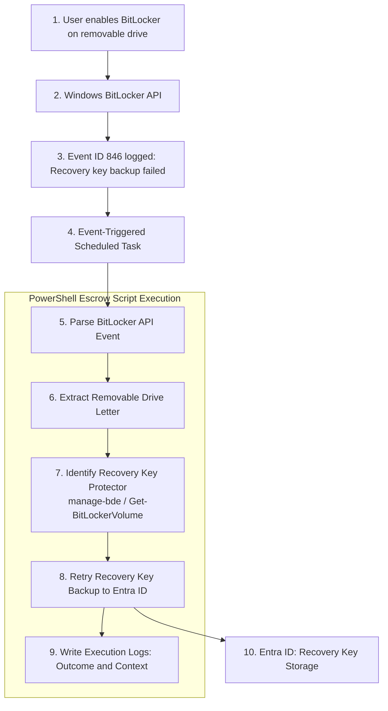

# BitLocker-to-Go Recovery Key Escrow – Architecture Flow

## Context

In Hybrid Entra ID joined Windows environments, BitLocker-to-Go recovery
key backup to Entra ID may fail or emit failure events even when relevant
Group Policy and Intune configurations are correctly applied.

In these scenarios, the failure does not always surface through
user-facing prompts or administrative alerts, creating a quiet
operational and audit risk.

This design leverages **observable platform behavior** rather than
configuration enforcement alone, using native Windows signals to detect
and compensate for recovery key escrow failures.

---

## Event-Driven Signal

When a user enables BitLocker on a removable USB drive, Windows attempts
to back up the BitLocker-to-Go recovery key as part of the encryption
workflow.

If the backup operation fails, Windows emits the following event:

- **Log:** Microsoft-Windows-BitLocker-API/Management
- **Event ID:** 846
- **Description:** Recovery key backup to Entra ID failed
- **Context Provided:** Affected removable drive letter

This event is treated as a **deterministic signal**, not an exception to
suppress or ignore.

---

## Execution Model

### Event-Triggered Scheduled Task

An event-triggered scheduled task is registered on the endpoint with the
following characteristics:

- Triggered immediately when Event ID 846 is logged
- Executes under the local **SYSTEM** context
- Performs no logic beyond dispatching execution
- Invokes a dedicated PowerShell escrow script

The scheduled task functions purely as a **native dispatcher**, ensuring
the remediation logic is only executed in response to a verified failure
signal.

---

## Detailed Architecture Flow

The diagram above illustrates the event-driven execution flow for BitLocker-to-Go recovery key escrow on Hybrid Entra ID joined devices.

**Key points:**

- The **event-triggered scheduled task** ensures the script runs immediately after a backup failure (Event ID 846).  
- All control logic after event detection is fully handled by the **PowerShell escrow script**: it parses the event, extracts the target drive, retrieves the recovery key, retries escrow to Entra ID, and logs execution details.  
- Logging is **first-class**, providing operational visibility, troubleshooting context, and audit evidence without exposing recovery key material.  
- This approach runs safely and automatically, using only built-in Windows features and the device’s existing trust with Entra ID.  
- The architecture scales across endpoints and complements native BitLocker behavior without introducing additional agents or infrastructure.

---

## PowerShell Escrow Script Responsibilities

Once invoked, the PowerShell escrow script performs the following actions in a single execution flow:

- Parses the BitLocker API failure event to establish execution context  
- Extracts the affected removable drive letter from the event payload  
- Enumerates BitLocker key protectors for the target volume  
- Identifies the **RecoveryPassword** key protector  
- Retries backing up the recovery key to Entra ID using native BitLocker tooling  
- Records execution state and outcome through local logging  

All operations are performed non-interactively and do not require user awareness or input.

---

## Execution Context and Trust Boundary

The escrow script executes under the local **SYSTEM** context and relies on the device’s existing trust relationship with Entra ID.

- No credentials, tenant identifiers, or secrets are embedded or handled by the script.  
- Recovery key escrow is performed using native Windows BitLocker APIs within the platform’s established security model.

---

## Failure Handling and Stability

The script performs a **single retry per triggering event**.  

It does not implement:

- Continuous background polling  
- Infinite or recursive retry loops  
- Event suppression or modification  

Each execution is directly tied to a discrete failure signal, ensuring predictable behavior and stability at scale.

---

## Safe Re‑execution

The recovery key escrow operation is **safe to run multiple times** for an existing key protector.  

If the recovery key has already been successfully backed up, subsequent executions do not create duplicate recovery entries or alter existing state. This ensures safe re-execution in environments where events may be re-emitted or tasks re-invoked.

---

## Logging and Observability

Logging is treated as a **first-class design element**.  

The escrow script records:

- Execution timestamp  
- Target removable drive  
- Escrow retry outcome (success or failure)  
- Error conditions encountered during execution  

Logs are intended to provide operational visibility, troubleshooting context, and audit-friendly evidence of automated remediation activity **without exposing recovery key material**.

---

## Architectural Characteristics

- **Event-driven:** Executes only in response to a verified failure signal  
- **Compensating control:** Complements native BitLocker behavior rather than replacing it  
- **Agentless:** Uses only built-in Windows components  
- **Auditable:** Produces observable execution artifacts  
- **Scalable:** Designed for consistent behavior across large endpoint populations  

---

## Architectural Takeaway

Endpoint security controls do not always fail loudly or consistently.  

By treating BitLocker-to-Go recovery key escrow as a behavioral system and responding reliably to native failure signals, this architecture closes a quiet but operationally significant gap **without introducing new infrastructure or weakening the platform’s security model**.
