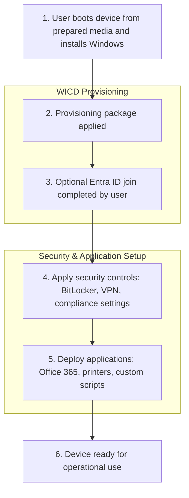

# Serverless Windows Provisioning Using Windows Imaging and Configuration Designer (WICD)
## A Formal Technical White Paper

---

## Abstract

This document describes a **serverless approach** to provisioning Windows 10 and Windows 11 devices using Windows Imaging and Configuration Designer (WICD).  
The architecture is intended for environments where traditional deployment infrastructure is unavailable, undesirable, or intentionally avoided.

The solution enables:

- Out-of-box device provisioning
- Entra ID (Azure AD) enrollment (optional)
- Security baseline configuration
- Application deployment using native Windows tooling

All without reliance on on‑premises servers or modern cloud provisioning services.

---

## Motivation and Context

Modern endpoint provisioning typically assumes either:

1. Full infrastructure: Active Directory, SCCM, PXE, imaging pipelines  
2. Fully cloud-based solutions: Windows Autopilot / Intune

However, many organizations fall **between these extremes** or deliberately operate in minimal-infrastructure environments:

- Small offices or training labs with 5–20 workstations
- Temporary or shared computer labs
- Scenarios requiring **offline deployment**
- Situations where cost or infrastructure constraints prevent server-based deployment

This serverless approach enables organizations to prepare devices securely and consistently, **without extra infrastructure**, while maintaining a modern security posture.

---

## Problem Statement

Challenges addressed by this architecture:

- Absence of deployment infrastructure
- Limited network connectivity during provisioning
- Transitional stages of cloud adoption
- Security policies restricting standing server components

Conventional imaging or cloud-native solutions may not be feasible in these scenarios. This architecture bridges that gap.

---

## Design Goals

- **Serverless by design:** No deployment servers or databases  
- **Native tooling only:** Leverage Windows built-in capabilities  
- **Repeatable provisioning:** Deterministic outcomes across devices  
- **Security-first configuration:** Encryption, identity, and compliance applied early  
- **Minimal operational dependency:** Users self-provision safely, guided by clear instructions  

---

## Solution Overview

The architecture uses:

- Windows Imaging and Configuration Designer (WICD)  
- Provisioning packages (`.ppkg`)  
- Bootable installation media (USB/DVD)  
- Native Windows enrollment and management mechanisms  

All configuration logic applies **during provisioning**, so devices reach a secure, manageable state **immediately after first sign-in**.

---

# Windows Provisioning Flow – Serverless WICD Approach

This diagram illustrates the high-level provisioning flow for Windows 10/11 devices
using a serverless Windows Imaging and Configuration Designer (WICD) approach.
It highlights the steps managed by the WICD provisioning package and post-provisioning
actions including security and application deployment.

## Use Cases / Scenarios

### Small Office Deployment
- 5–20 workstations
- Devices can remain Workgroup joined or optionally join to Active Directory Domain or Entra ID (Azure AD)
- Full provisioning and application installation without IT infrastructure

### Training Lab or Temporary Workstations
- Devices reused for courses or workshops
- Rapid provisioning with security controls and baseline apps
- No dependency on AD, SCCM, or cloud enrollment

### Hybrid / Transitional Environments
- Devices can later integrate into cloud management (Autopilot, Intune)
- Optional bulk Azure AD join using WICD provisioning package

---

## Security Considerations
- **Encryption:** BitLocker enabled automatically; recovery key escrowed to Entra ID  
- **Credential Handling:** No secrets embedded in provisioning artifacts  
- **Platform Trust:** Relies solely on native Windows security boundaries  
- **Auditability:** Logs and provisioning artifacts can be inspected  

**Screenshot Placeholder:**  
``

---

## Operational Notes
- Approximate provisioning time: ~11 minutes per device  
- Users follow guided steps for booting media and completing optional Azure AD join  
- Post-provisioning validation recommended: verify security settings, application installation, and network access  

---

## Limitations
- This architecture is **not a replacement** for Autopilot or full Intune enrollment  
- Network-dependent features (cloud profiles, Intune policies) require additional configuration  
- Designed for **small-scale, infrastructure-light deployments**  

---

## References
- [Windows Imaging and Configuration Designer Documentation](https://docs.microsoft.com/en-us/windows/configuration/provisioning-packages/provisioning-tool-overview)  
- [Microsoft BitLocker Guidance](https://docs.microsoft.com/en-us/windows/security/information-protection/bitlocker/bitlocker-overview)  

---

## Conclusion
This reference architecture demonstrates that **secure, consistent, and serverless provisioning of Windows 10/11 devices** is achievable without traditional deployment infrastructure.  

By leveraging **native Windows capabilities and observable platform behavior**, organizations can bridge modernization gaps safely and cost-effectively, while maintaining a strong security posture.
